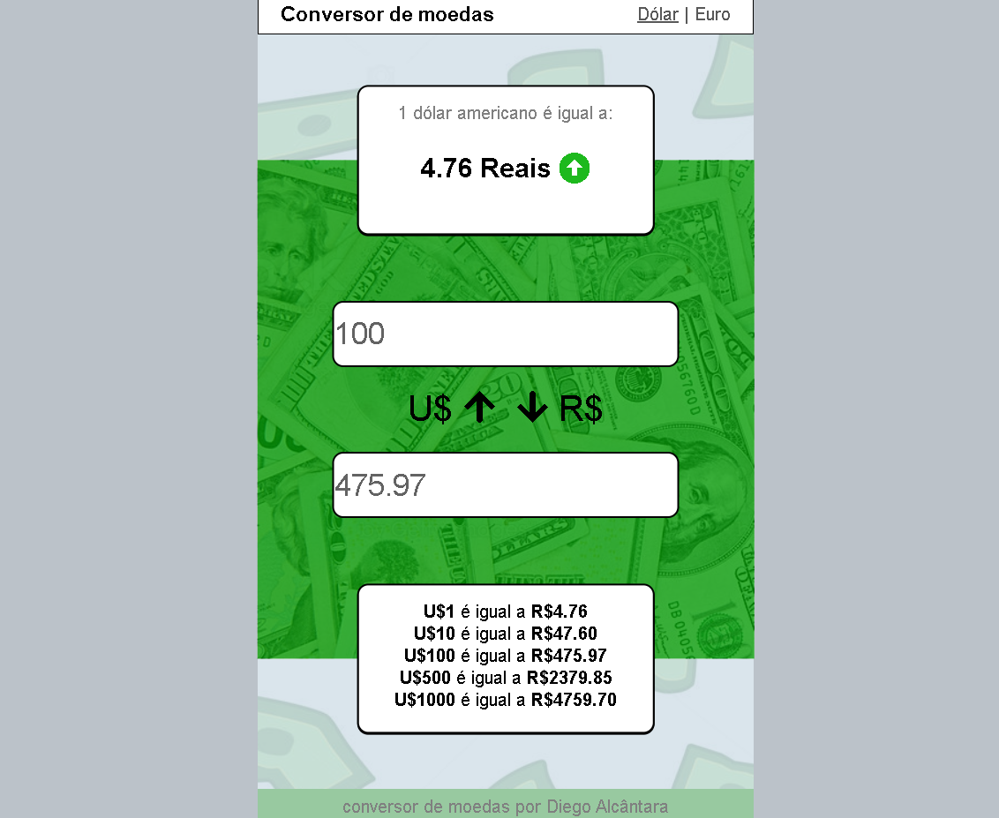

<h1 align="center">
    
</h1>

# Conversor de moedas

<a align="center" style="font-weight: bold" href="https://alcantara-diego.github.io/conversordemoedas/" target="_Blank">👉Acesse meu projeto nesse link👈</a>

  

<h3>Tecnologias usadas no projeto</h3>
<ul>
<li>HTML5</li>
<li>CSS3</li>
<li>Javascript</li>
</ul>

  
# Descrição

Aplicativo de consulta e conversão dos valores do <strong>Dólar</strong> e <strong>Euro</strong> para <strong>Reais</strong>

Um dos meus primeiros projetos desenvolvidos e pude aprender a extrair informações de terceiros por meio de <strong>API</strong>.

# Aprendizados com o projeto:

<strong>Consumo de APIs e JSON:</strong> Aprendi usar o <strong>Fetch</strong> do javascript para extrair o conteúdo de <strong>APIs</strong>, e usar as informações que vem em formato de <strong>JSON</strong>.

<strong>Figma:</strong> Simplificando, o Figma é um aplicativo de protótipo de telas, e obtive um certo conhecimento ao usar a ferramenta, pois antes de iniciar o projeto eu criei o design no próprio figma com alguns conceitos que aprendi de <strong>UI/UX</strong>.

 <strong>Conceitos básicos de UI/UX:</strong>Fiz um curso básico de <strong>UI/UX design</strong>, e nesse projeto coloquei em prática os conhecimentos adquiridos, como por exemplo <strong>White space</strong>, <strong>Contraste</strong> e <strong>Hierarquia visual</strong>, para criar o design do app no <strong>Figma</strong>. 

  

# Features do projeto:
 <strong>Converter o valor do Euro ou Dólar para Reais</strong>
 
   
 # Pré-requisitos:

 Nenhum pré-requisito necessário, apenas te convido a dar uma olhada :)

 
<a align="center" style="font-weight: bold" href="https://alcantara-diego.github.io/conversordemoedas/" target="_Blank">👉Acesse meu projeto nesse link👈</a>

  

<strong>|Made with ❤️ by Diego Alcântara 👨🏽‍💻 <a align="center" style="font-weight: bold" href="https://www.linkedin.com/in/diego-alc%C3%A2ntara-790424235" target="_Blank">See my linkedIn</a></strong>

